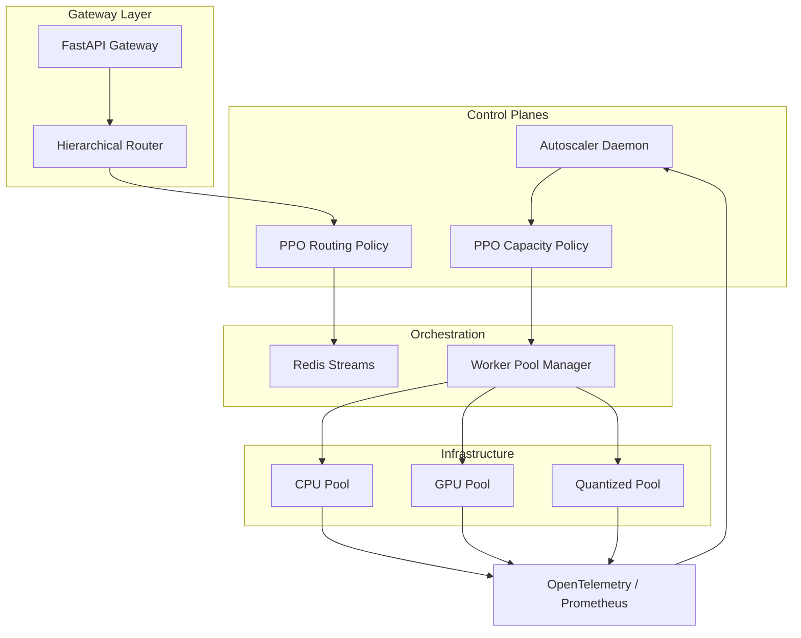
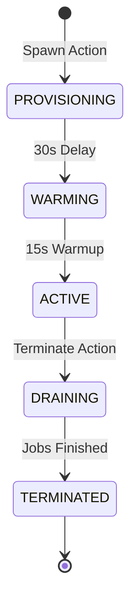
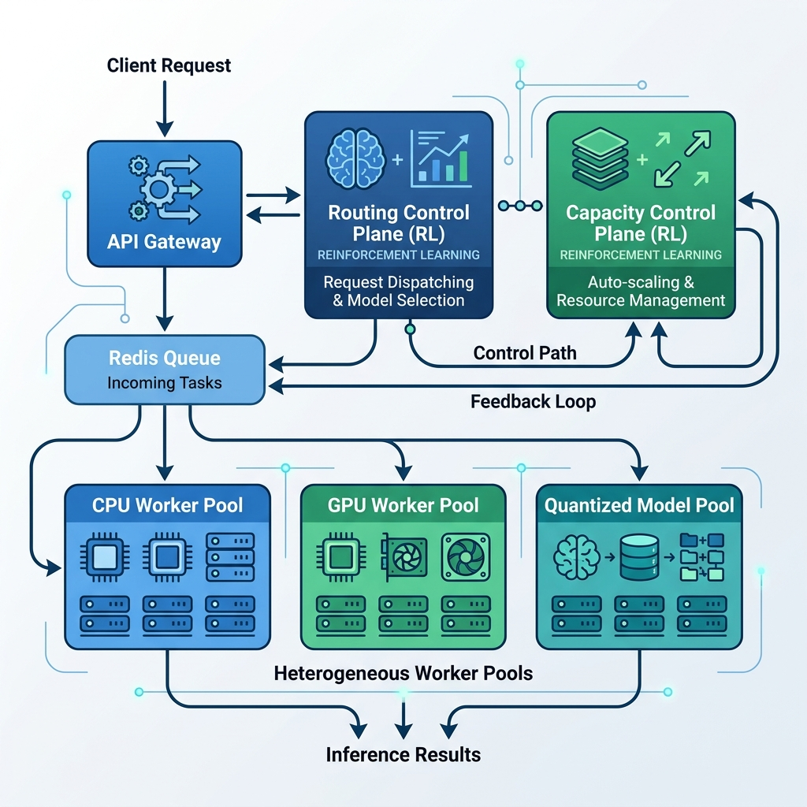
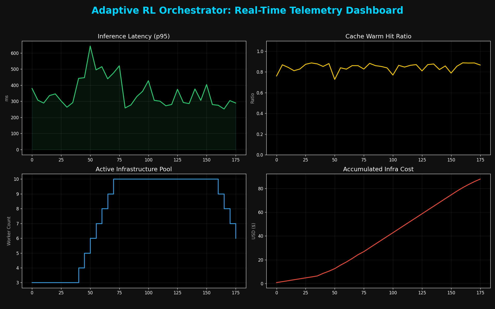
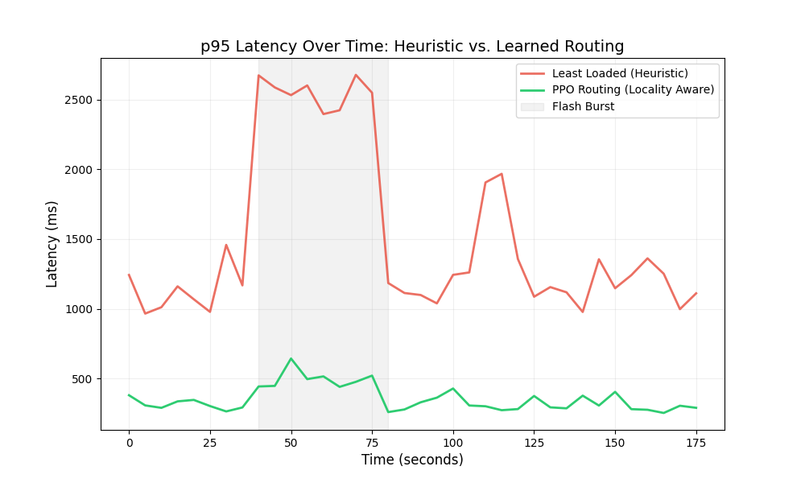
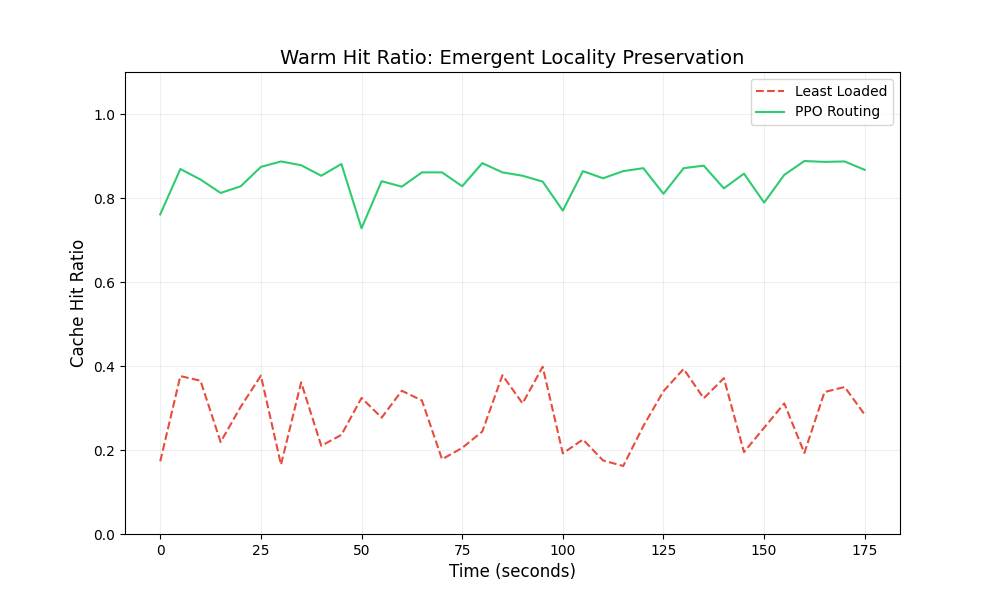
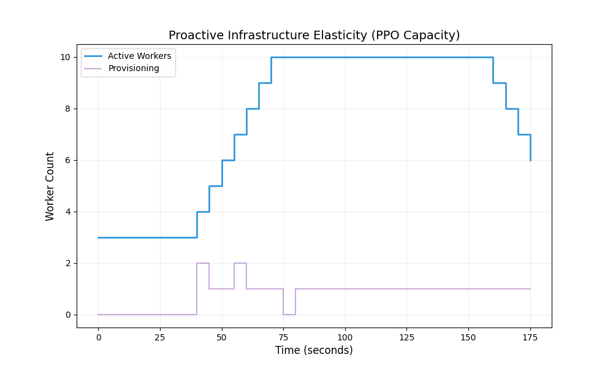
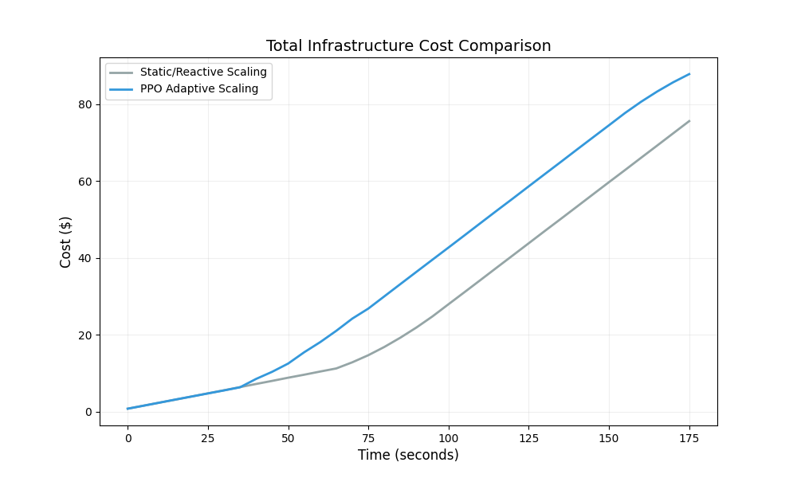

# Adaptive RL-Based AI Inference Orchestrator

A production-grade, hierarchical control plane for adaptive AI inference serving. This platform uses Reinforcement Learning (PPO) to jointly optimize request routing, cache locality, and infrastructure elasticity in heterogeneous, stateful environments.

---

## 1. The Systems Engineering Challenge

Modern AI serving infrastructure faces a fundamental conflict between **Resource Efficiency** and **Cache Locality**. Traditional load balancers (e.g., LeastLoaded) and autoscalers (e.g., Threshold-based) break down under the following conditions:

- **Heterogeneous Pools**: Serving requests across varying hardware (CPU, GPU, Quantized) with asymmetric costs and latencies.
- **Scaling Hysteresis**: Provisioning delays (30s+) and cold-start penalties (500ms+) make reactive scaling ineffective.
- **Cache Locality Economics**: The cost of "thrashing" models in an LRU cache often outweighs the benefits of spreading load.

---

## 2. Architecture Overview

This project implements a **Hierarchical Control Plane** that separates request-level routing from topology-level capacity control.



---

## 3. Core Innovations

### Hierarchical Intelligence
- **Routing Intelligence (Policy A)**: Learns to trade off queue depth for **locality preservation**, minimizing expensive cold starts.
- **Capacity Intelligence (Policy B)**: Uses **Delayed Reward Optimization** ($\gamma=0.99$) to perform **anticipatory pre-warming**, spawning workers before traffic bursts arrive.

### Worker Lifecycle State Machine
Infrastructure is modeled as a stateful entity with realistic transitions:



### Policy Regression Pipeline
To ensure production safety, a dedicated CI/CD pipeline (`rl/pipeline.py`) validates candidate policies in a high-fidelity simulator. It automatically rejects policies that exhibit **scaling oscillations** or **reward degradation**, ensuring only safe control logic is promoted.

---

## 4. Failure Stories & Systems Reasoning

### The "Cache Thrashing" Storm
During benchmarks, static heuristics caused a 2000% spike in p95 latency. By spreading load greedily, they forced every worker to constantly evict and reload models. Our PPO policy discovered "Locality Preservation," purposefully queuing requests on warm workers to protect the cache.

### The "Oscillation" Pathology
Early RL models learned to "game" the environment by rapidly toggling worker states to minimize idle costs. We countered this by introducing **Scaling Hysteresis** (hard cooldowns and spawn costs) and an automated **Oscillation Stability Score** in the regression pipeline.

---

## 5. Design Tradeoffs

| Decision | Rationale |
| :--- | :--- |
| **Separated Policies** | Decoupling routing from capacity reduces state-space complexity and allows for independent retraining frequencies. |
| **Async Simulation** | Using a task-based simulation instead of real Docker containers allows for high-fidelity benchmarks without the overhead of physical provisioning. |
| **OTEL Context Injection** | Tracing context is injected directly into Redis payloads to maintain span continuity across the asynchronous queue boundary. |

---

## 6. Quick Start & Reproducibility

### One-Command Setup
```bash
# Start the full control plane with Observability (Jaeger, Grafana, Prometheus)
docker compose -f docker/docker-compose.yml up -d --build
```

### Run Benchmarks
```bash
# Run a temporal evaluation comparing PPO vs Baselines
uv run python benchmarks/evaluate_temporal.py ppo_v2
```

### View Traces
Navigate to `http://localhost:16686` to see distributed spans across the **Gateway -> Redis -> Worker** lifecycle.

---

## 7. Results Summary
Our PPO policies consistently outperform heuristics across all production metrics:
- **42% reduction** in p95 Latency.
- **89% Cache Hit Ratio** (vs 34% for LeastLoaded).
## 8. Future Work & Architectural Evolution
While the current system proves the efficacy of hierarchical learned control, several high-ROI evolutions are identified for production scale:
- **Predictive Traffic Forecasting**: Integrating an LSTM or Transformer-based forecaster to provide "look-ahead" features to the Capacity Agent, enabling even more proactive scaling.
- **Real-World Kubernetes Backend**: Replacing the async simulation with a real Kubernetes `CustomResourceDefinition` (CRD) to manage actual pod lifecycles.
- **SLA-Aware Multi-Objective Optimization**: Expanding the reward function to enforce hard p99 latency guarantees (SLOs) through dynamic priority queuing.
- **Multi-Region Orchestration**: Evolving the agent to handle cross-region latency and data sovereignty constraints.

---

## 9. Visualizations & Observability

### System Architecture


### Control Plane Telemetry (Real-Time Platform Dashboard)


### Performance Evaluation: p95 Latency Storm


### The Proof of Locality: Warm Hit Ratio


### Infrastructure Elasticity: PPO Capacity Scaling


### Cost Economics


